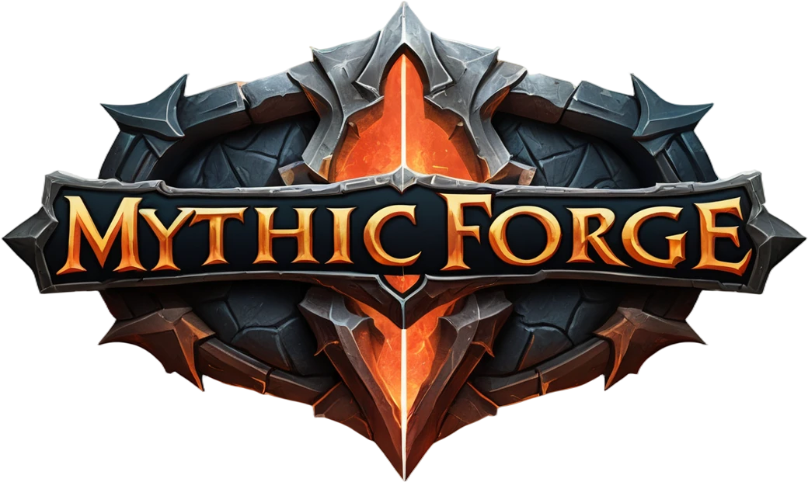
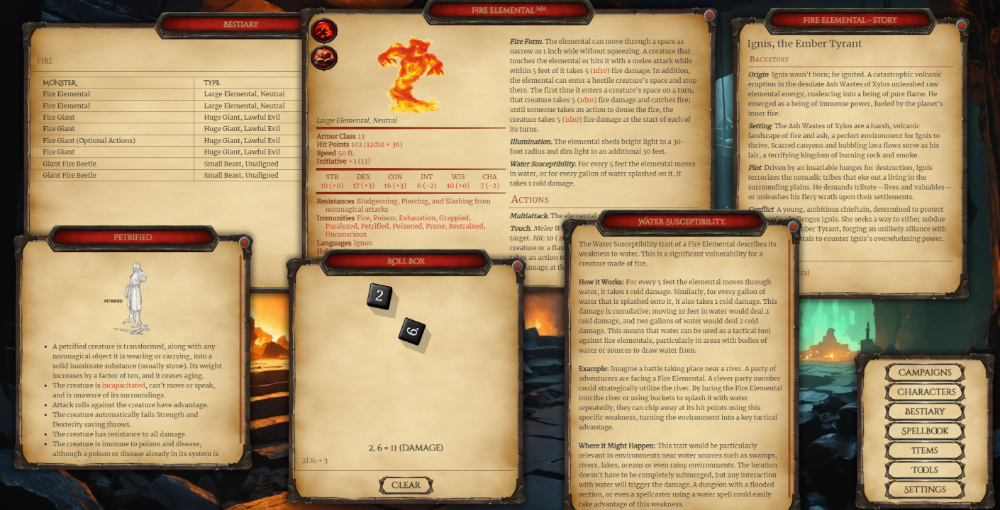

[](https://www.gnu.org/licenses/agpl-3.0)
[](https://www.python.org/downloads/)
[](https://nodejs.org/)

<div align="center">
  
</div>

---

<div align="center">
  <strong>🏰 A powerful D&D 5E campaign management, digital reference, character creation and various tools powered by AI. MythicForge combines traditional tabletop gaming with advanced AI capabilities to enhance your roleplaying experience. 🧙‍♂️</strong>
</div>

---

## VERSION: 0.0.1 EARLY PRE-ALPHA

## ✨ Planned Features

- **Complete D&D 5E Database**
  - Spells, items, monsters, and more
  - Quick search and filtering

- **Character Creation & Management**
  - Interactive character builder
  - Automatic stat calculations
  - Character sheet export/import
  - Custom character artwork integration

- **AI-Powered Campaign Tools**
  - AI Dungeon Master mode
  - Dynamic NPC generation
  - Intelligent encounter scaling
  - Campaign story generation
  - Memory-aware storytelling

- **Flexible AI Integration**
  - OpenAI, Google Gemini support
  - Local AI option for offline use
  - Customizable AI parameters

- **DM Tools**
  - Random encounter generator
  - Custom monster creator
  - Loot table generator
  - Initiative tracker
  - Interactive maps

- **Dice Roller**
  - Customizable dice sets
  - Advanced roll modifiers
  - History and statistics tracking

## 🚀 Getting Started

### Prerequisites

- Python 3.8 or higher
- Node.js 14.x or higher
- SQLite3

### Installation

1. Clone the repository
```bash
git clone https://github.com/armysarge/mythicforge.git
cd mythicforge
```

2. Install Python dependencies
```bash
pip install -r requirements.txt
```

3. Install Node.js dependencies
```bash
npm install
```

4. Configure your environment
```bash
cp .env.example .env
# Edit .env with your API keys and preferences
```

5. Start the application
```bash
npm run start
```

6. To update the application, run
```bash
python scripts/update.py
```

The application will be available at `http://localhost:3000`

## 🔧 Configuration

### AI Provider Setup

Configure your preferred AI provider in the `.env` file:

```env
AI_PROVIDER=openai  # Options: openai, gemini, local
OPENAI_API_KEY=your_key_here
GEMINI_API_KEY=your_key_here
```

<!--### Local AI Setup

For offline AI functionality:
1. Download the required models using `python scripts/download_local_models.py`
2. Enable local AI mode in settings-->

## 📋 Roadmap

- [x] Include D&D 5E database (Thanks to [5eTools](https://5e.tools/))
- [ ] Basic UI/UX Design (In progress)
- [ ] Database integration & search functionality
- [ ] DM tools (Dice roller, encounter generator,  Initiative tracker, etc.)
- [ ] Character builder
- [ ] Campaign manager
- [ ] AI Integration (OpenAI, Google Gemini)
- [ ] AI Integration (Local AI Model, requires extra setup)
- [ ] AI-powered DM tools
- [ ] AI-powered character builder
- [ ] AI-powered campaign tools
- [ ] Dungeon/Map Generator
- [ ] Soundboard for ambient sounds
- [ ] Multi-language support
- [ ] Mobile companion app
- [ ] Customizable character artwork

<!--## 📚 Documentation

For detailed documentation, visit our [Wiki](https://github.com/armysarge/MythicForge/wiki)-->

## 📈 Progress Screenshot



## 🤝 Contributing

Contributions are welcome! Please read our [Contributing Guide](CONTRIBUTING.md) for details on our code of conduct and the process for submitting pull requests.

## 📄 License

This project is licensed under the AGPL License - see the [LICENSE](LICENSE) file for details.

## 🙏 Acknowledgements

- OpenAI and Google for AI capabilities
- The data was taken from [5eTools](https://5e.tools/).
All data is owned by Wizards of the Coast.
The data is licensed under the Open Gaming License.
- 3d-dice for the dice rolling animation and logic[3d-dice](https://github.com/3d-dice)
- BoxIcons for the icons used in the project [BoxIcons](https://boxicons.com/)
- Jquery for the JavaScript library [Jquery](https://jquery.com/)
- Bootstrap for the CSS framework [Bootstrap](https://getbootstrap.com/)
- Node.js for the JavaScript runtime [Node.js](https://nodejs.org/)
- Other open-source projects that made this possible (see [package.json](package.json), [requirements.txt](requirements.txt))
- The D&D community for inspiration and feedback

## 💬 Support

- Create an [Issue](https://github.com/armysarge/mythicforge/issues)
- Join our [Discord](https://discord.gg/G5W2QZBevz)
- Telegram [Group](https://t.me/+jg68TLcxyl9kYWI8)
- Email: armysarge.ss@gmail.com

## ☕ Buy me a coffee

If you like this project, consider buying me a coffee to keep me motivated!

[](https://buymeacoffee.com/armysarge)
---

Built with ❤️ for the D&D community